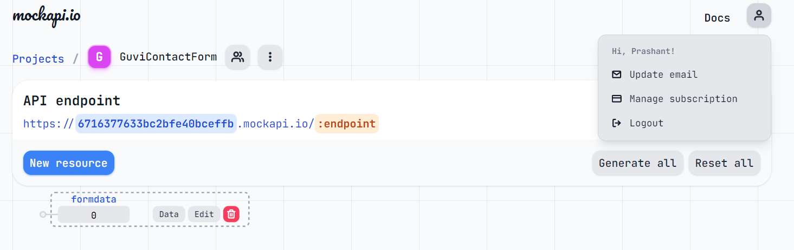

To run locally, clone this repository

Install the node packages: 

typescript: `npm install typescript --save-dev`

httpserver `npm install -g http-server`

Run the project using `npm run build`

Then run the server using `http-server`

Get my [mockAPI endpoint](https://6716377633bc2bfe40bceffb.mockapi.io/formdata) for submission of the formdata.